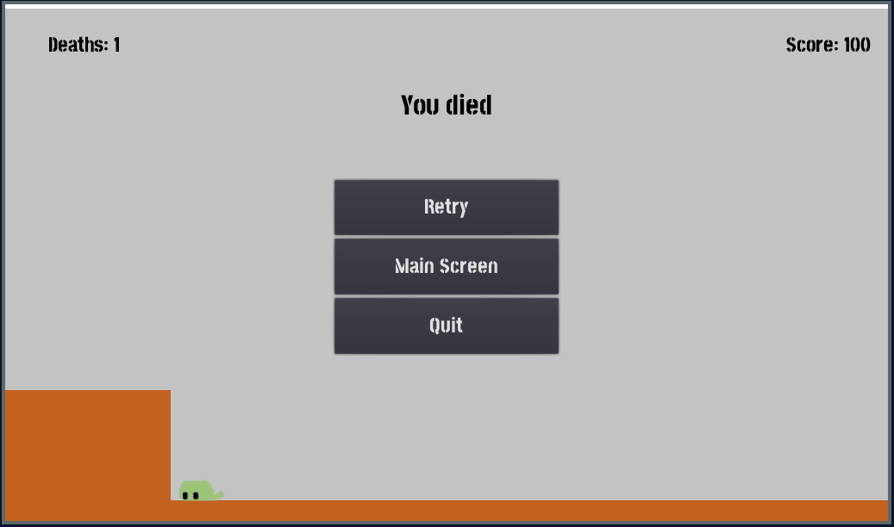
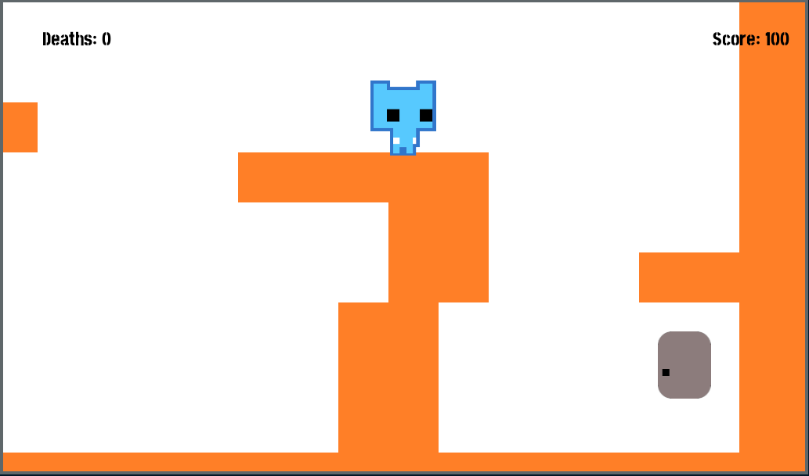

#	Our implementation of a 2D Platformer Game, with the [Godot](https://godotengine.org) an open-source game-engine.

The final part of the code, or all the game code, scenes, assets are available in the main branch. If you want to check the final state of the project, use the files from the `main` branch.

## [tmpdemo](malders/tmpdemo)
[This](malders/tmpdemo) is the folder containing all the code, the finalised part of the code.

### How to download and run the game?
Download Godot game-engine first (Don't worry, it's not that big of a download; it's just around 40MB at the max. Download the Stable, Standard version. There's no need for the Mono-version (C# supported one)). Then, clone the repo's main branch to your local machine. Open Godot, it will be an executable file, a portable application, which will run without any setup/installation. Then, a startup screen will be displayed, where you will find an option to import a project among the list of options on the right. Click that, navigate to the folder you cloned, and select the [`project.godot`](malders/tmpdemo/project.godot) file inside that folder. Click import, and voila; the project should now be open in the editor.

Navigate to `malders/tmpdemo/src/Screens/MainScreen.tscn` on the FileSystem pane on the left. Double click that scene, to open it. Now press `F6` to play the current scene. Congrats, you can now play the game.

** Note: ** I indeed plan on making a single executable file, which can be downloaded straight-away to play the game directly, but it won't be happening any sooner. So, until then, kindly put-up with this, and try the game out, as described above.

### Own [Assets](malders/tmpdemo/assets/own/) folder:
 [This](malders/tmpdemo/assets/own/) folder contains all the assets, made without any help. [RadicalMagic](https://github.com/RadicalMagic) also helped with this project, by contributing to ideas, and helping with the design ideas at the initial stages of the project.

### Some Screenshots of the game :

<screenshots>

	
Click to expand and View Screenshots!

	Main Menu :
	
	
	Timer Menu:
	
	
	Level 01:
	
	
	Level 01 Portal cannot be accessed without key:
	
	
	Level 01 Portal:
	
	
	Level 02:
	
	
	Death screen:
	
	
	Level 02 Portal:
	
	
	Level 03:
	
	
	End Screen:
	
	
</screenshots>

### A Video showing the gameplay of the game.

### In Game controls :
`W` key/ `Up Arrow` key/ `Spacebar` = Up
`A` key/ `Left Arrow` key = Left
`D` key/ `Right Arrow` key = Right

### Game Instructions / Rules :
There are 3 levels. They're all very basic as of now, and I plan on making them harder with time.. But, as for now, we have to make do with this...
So, now inorder to clear each level, the player has to collect the `key` and reach the portal without dying.
